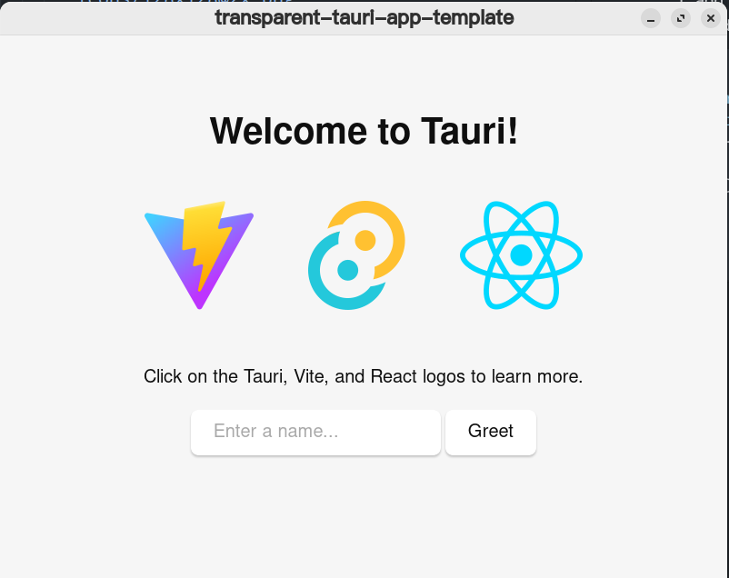
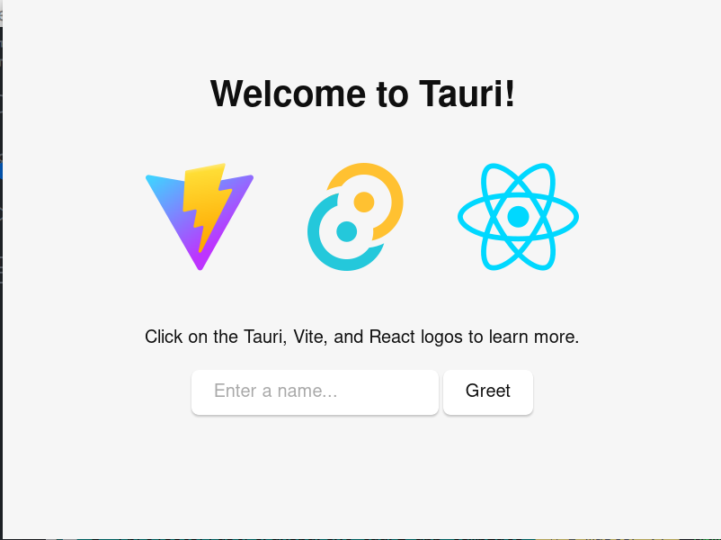

A simple demo of creating a transparent tauri window.

# Steps

1. add `"decorations": false` to `tauri.conf.json`, so that the window is borderless.

```JSON
{
  "tauri": {
    "windows": [
      {
        "decorations": false
      }
    ]
  }
}
```

before:



after:



2. add `"transparent": true` to `tauri.conf.json`, so that the window is transparent.

```JSON
{
  "tauri": {
    "windows": [
      {
        "transparent": true
      }
    ]
  }
}
```

**NOTE**: according to [tauri docs](https://tauri.app/v1/api/config/#windowconfig)，you need to enable `macos-private-api` feature flag to use this feature on macOS.

> on macOS this requires the macos-private-api feature flag, enabled under tauri > macOSPrivateApi. 

3. add some css to your html file to make the webview transparent.

After doing #2, your window will be transparent, but the webview will not.To make the webview transparent, you need to add some css to your html file. For example, you can add the following css to your html file. 

```CSS
html, body {
  background-color: transparent;
}
```

If the window is not transparent, you need to check if some css in your html file is overwriting the transparency or there are some elements covering the webview that are not transparent.

after:


